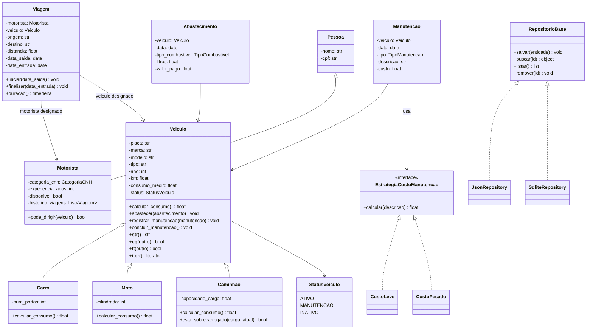

```mermaid
classDiagram
    class Veiculo {
        -placa: str
        -marca: str
        -modelo: str
        -tipo: str
        -ano: int
        -km: float
        -consumo_medio: float
        -status: StatusVeiculo
        +calcular_consumo() float
        +abastecer(abastecimento) void
        +registrar_manutencao(manutencao) void
        +concluir_manutencao() void
        +__str__() str
        +__eq__(outro) bool
        +__lt__(outro) bool
        +__iter__() Iterator
    }

    class Carro {
        -num_portas: int
        +calcular_consumo() float
    }

    class Moto {
        -cilindrada: int
        +calcular_consumo() float
    }

    class Caminhao {
        -capacidade_carga: float
        +calcular_consumo() float
        +esta_sobrecarregado(carga_atual) bool
    }

    class Pessoa {
        -nome: str
        -cpf: str
    }

    class Motorista {
        -categoria_cnh: CategoriaCNH
        -experiencia_anos: int
        -disponivel: bool
        -historico_viagens: List~Viagem~
        +pode_dirigir(veiculo) bool
    }

    class Viagem {
        -motorista: Motorista
        -veiculo: Veiculo
        -origem: str
        -destino: str
        -distancia: float
        -data_saida: date
        -data_entrada: date
        +iniciar(data_saida) void
        +finalizar(data_entrada) void
        +duracao() timedelta
    }

    class Manutencao {
        -veiculo: Veiculo
        -data: date
        -tipo: TipoManutencao
        -descricao: str
        -custo: float
    }

    class Abastecimento {
        -veiculo: Veiculo
        -data: date
        -tipo_combustivel: TipoCombustivel
        -litros: float
        -valor_pago: float
    }

    class EstrategiaCustoManutencao {
        <<interface>>
        +calcular(descricao) float
    }

    class CustoLeve
    class CustoPesado

    class RepositorioBase {
        +salvar(entidade) void
        +buscar(id) object
        +listar() list
        +remover(id) void
    }

    class JsonRepository
    class SqliteRepository

    class StatusVeiculo {
        ATIVO
        MANUTENCAO
        INATIVO
    }

    Veiculo <|-- Carro
    Veiculo <|-- Moto
    Veiculo <|-- Caminhao
    Pessoa <|-- Motorista

    EstrategiaCustoManutencao <|.. CustoLeve
    EstrategiaCustoManutencao <|.. CustoPesado

    RepositorioBase <|.. JsonRepository
    RepositorioBase <|.. SqliteRepository

    Viagem --> Motorista : motorista designado
    Viagem --> Veiculo : veiculo designado
    Manutencao --> Veiculo
    Manutencao ..> EstrategiaCustoManutencao : usa
    Abastecimento --> Veiculo
    Veiculo --> StatusVeiculo
```
